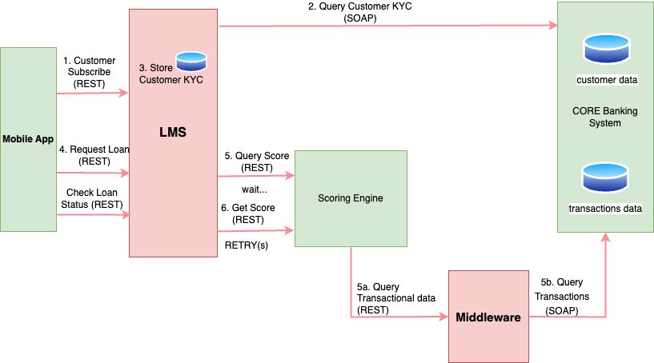

# Coding Exercise

## Assumption

You are working for a company which is building a Digital **Lending Platform**. The company has partnered with a scoring company, which has developed a **Scoring Engine**, and a **Bank**.

The platform is supposed to extend micro loan products to the Bank customers. Bank customers access bank services through a multi channel Mobile Application (USSD, iOS and Android). The Lending Platform has to be able to extend APIs to the Mobile Application, query the Scoring Engine, and consume data from the CORE Banking System.

Both The Scoring Company and the Bank have shared very high level API documentation, enough to allow you complete your integrations.

## The Exercise

You are required to develop a simple Loan Management Module (LMS) which will be integrated to the Bank's CORE Banking system (CBS) and the Scoring Engine. Customers will be accessing the lending product through the Bank Mobile Application.

Depending on your architectural decision and implementation, you may develop a separate component, to expose transactional data to the Scoring Engine.

The CBS system exposes to your implementation two **SOAP** APIS:

1. KYC API from which you will be able to fetch customer information
2. Transactions Data API which you will be able to fetch historical transactional records for the customer.

Your LMS module will expose **RESTful** APIs to a client Application:

1. Subscription API. The Mobile Application will submit a Customer Number
2. Loan request API. The Mobile Application will submit a customer Number and an amount
3. Loan Status API. The Mobile Application will query for the loan status.

You will make a design decision as to what needs to be returned back to the Mobile Application for the above three calls. The API documentation should be provided.

**Note**: Customers should not be able to apply for another loan if there is an ongoing loan request.

LMS should then be able to query the scoring engine to get the score and the limit before issuing a loan to the customer. Getting scoring and limits is a two steps process:

1. Initiate query score, which you will submit a customer number and receive back a token
2. Query score using the token from the previous step.

Between step one and two, the scoring engine takes time to process. You will be required to develop a mechanism to retry the second step. Retries should be capped (you will decide how many reties). If no response is coming back from the scoring engine after exhausting the retries, the loan application should fail, and allow the customer to apply for a new loan.

Scoring Engine requires the transaction data to process the scoring and limits. You need to consume the transaction API, and expose a RESTful API to the Scoring Engine.

Note that the scoring engine would then need to be aware of your endpoint. For this to work, we have created a service to allow you to register your endpoint. Call the following endpoint to register your endpoint:

`https://scoringtest.credable.io/api/v1/client/createClient`

**METHOD**: POST

**Request Payload:**
```json
{
  "url": "[YOUR ENDPOINT URL]",
  "name": "[NAME OF YOUR SERVICE]",
  "username": "[YOUR BASIC AUTHENTICATION USERNAME]",
  "password": "[YOUR BASIC AUTHENTICATION PASSWORD]"
}
```

**Response:**
```json
{
  "id": 0, // generated client id
  "url": "[YOUR ENDPOINT]",
  "name": "[NAME OF YOUR SERVICE]",
  "username": "[BASIC AUTHENTICATION USERNAME]",
  "password": "[BASIC AUTHENTICATION PASSWORD]",
  "token": "[GENERATED UNIQUE UUID]" // use this to make call for scoring
}
```

The Scoring Engine will then be able to call your RESTful endpoint, with the credentials to retrieve the transactional data. Please look at the API section below for the transaction data format.

The **GENERATED UNIQUE UUID** will then be used for the consecutive calls for score retrieval.



Below flow diagram depicts the flow of information. **You are supposed to develop components and APIs coloured in RED**. Green blocks are already provided.

## APIS

### KYC API

[Customer KYC WSDL](https://kycapitest.credable.io/service/customerWsdl.wsdl)

`https://kycapitest.credable.io/service/customerWsdl.wsdl`

### Transaction Data API
[Transaction Data WSDL](https://trxapitest.credable.io/service/transactionWsdl.wsdl)

`https://trxapitest.credable.io/service/transactionWsdl.wsdl`

**CORE Banking System SOAP Credentials:**
- **username**: admin
- **password**: pwd123

### SCORING APIs

**Step 1**: Initiate Query Score
`https://scoringtest.credable.io/api/v1/scoring/initiateQueryScore/{customerNumber}`

**METHOD**: GET

**Header**: client-token

**Response**: token

**Step 2**: Query the score.
`https://scoringtest.credable.io/api/v1/scoring/queryScore/{token}`

**METHOD**: GET

**Header**: client-token

**Response**:
```json
{
  "id": 9,
  "customerNumber": "",
  "score": 564,
  "limitAmount": 30000,
  "exclusion": "No Exclusion",
  "exclusionReason": "No Exclusion"
}
```

### Create CLIENT API
`https://scoringtest.credable.io/api/v1/client/createClient`

**METHOD**: POST

**Request Payload:**
```json
{
  "url": "[YOUR ENDPOINT]",
  "name": "[NAME OF YOUR SERVICE]",
  "username": "[BASIC AUTHENTICATION USERNAME]",
  "password": "[BASIC AUTHENTICATION PASSWORD]"
}
```

**Response:**
```json
{
  "id": 0, // generated client id
  "url": "[YOUR ENDPOINT]",
  "name": "[NAME OF YOUR SERVICE]",
  "username": "[BASIC AUTHENTICATION USERNAME]",
  "password": "[BASIC AUTHENTICATION PASSWORD]",
  "token": "[GENERATED UNIQUE UUID]" // use this to make call for scoring
}
```

### Transaction Data Response:
```json
[
  {
    "accountNumber": "332216783322167555621628",
    "alternativechanneltrnscrAmount": 87988.2441,
    "alternativechanneltrnscrNumber": 0,
    "alternativechanneltrnsdebitAmount": 675.3423,
    "alternativechanneltrnsdebitNumber": 902403930,
    "atmTransactionsNumber": 4812921,
    "atmtransactionsAmount": 561.96661249,
    "bouncedChequesDebitNumber": 8,
    "bouncedchequescreditNumber": 0,
    "bouncedchequetransactionscrAmount": 748011.19,
    "bouncedchequetransactionsdrAmount": 43345.569028578,
    "chequeDebitTransactionsAmount": 4.6933076819151E8,
    "chequeDebitTransactionsNumber": 44,
    "createdAt": 740243532000,
    "createdDate": 1196266216000,
    "credittransactionsAmount": 609.297663,
    "debitcardpostransactionsAmount": 21.134264,
    "debitcardpostransactionsNumber": 502,
    "fincominglocaltransactioncrAmount": 0.0,
    "id": 2,
    "incominginternationaltrncrAmount": 70.52733936,
    "incominginternationaltrncrNumber": 9,
    "incominglocaltransactioncrNumber": 876,
    "intrestAmount": 310118,
    "lastTransactionDate": 1169339429000,
    "lastTransactionType": null,
    "lastTransactionValue": 3,
    "maxAtmTransactions": 6.0,
    "maxMonthlyBebitTransactions": 5.66201073E8,
    "maxalternativechanneltrnscr": 0.0,
    "maxalternativechanneltrnsdebit": 0.0,
    "maxbouncedchequetransactionscr": 0.0,
    "maxchequedebittransactions": 0.0,
    "maxdebitcardpostransactions": 5.18696078798654E15,
    "maxincominginternationaltrncr": 0.0,
    "maxincominglocaltransactioncr": 0.0,
    "maxmobilemoneycredittrn": 0.0,
    "maxmobilemoneydebittransaction": 0.0,
    "maxmonthlycredittransactions": 0.0,
    "maxoutgoinginttrndebit": 0.0,
    "maxoutgoinglocaltrndebit": 0.0,
    "maxoverthecounterwithdrawals": 959858.0,
    "minAtmTransactions": 0.0,
    "minMonthlyDebitTransactions": 0.0,
    "minalternativechanneltrnscr": 0.0,
    "minalternativechanneltrnsdebit": 0.0,
    "minbouncedchequetransactionscr": 0.0,
    "minchequedebittransactions": 0.0,
    "mindebitcardpostransactions": 4.539102239610779E15,
    "minincominginternationaltrncr": 0.0,
    "minincominglocaltransactioncr": 0.0,
    "minmobilemoneycredittrn": 0.0,
    "minmobilemoneydebittransaction": 524.0,
    "minmonthlycredittransactions": 0.0,
    "minoutgoinginttrndebit": 0.0,
    "minoutgoinglocaltrndebit": 0.0,
    "minoverthecounterwithdrawals": 5821338.0,
    "mobilemoneycredittransactionAmount": 0.0,
    "mobilemoneycredittransactionNumber": 946843,
    "mobilemoneydebittransactionAmount": 0.0,
    "mobilemoneydebittransactionNumber": 5523407,
    "monthlyBalance": 6.59722841E8,
    "monthlydebittransactionsAmount": 103262.90429936,
    "outgoinginttransactiondebitAmount": 5.473303560725E7,
    "outgoinginttrndebitNumber": 646,
    "outgoinglocaltransactiondebitAmount": 565972.1236,
    "outgoinglocaltransactiondebitNumber": 2971,
    "overdraftLimit": 0.0,
    "overthecounterwithdrawalsAmount": 332.0,
    "overthecounterwithdrawalsNumber": 87569,
    "transactionValue": 1.0,
    "updatedAt": 773556430000
  },
  {
    "accountNumber": "332216783322167555621628",
    "alternativechanneltrnscrAmount": 27665.6889301,
    "alternativechanneltrnscrNumber": 0,
    "alternativechanneltrnsdebitAmount": 2.9997265951905E7,
    "alternativechanneltrnsdebitNumber": 114,
    "atmTransactionsNumber": 36934417,
    "atmtransactionsAmount": 192538.94,
    "bouncedChequesDebitNumber": 535,
    "bouncedchequescreditNumber": 0,
    "bouncedchequetransactionscrAmount": 1.37,
    "bouncedchequetransactionsdrAmount": 2602.4,
    "chequeDebitTransactionsAmount": 2765.57,
    "chequeDebitTransactionsNumber": 6,
    "createdAt": 1401263420000,
    "createdDate": 1350538588000,
    "credittransactionsAmount": 0.0,
    "debitcardpostransactionsAmount": 117347.063,
    "debitcardpostransactionsNumber": 931309756,
    "fincominglocaltransactioncrAmount": 2552389.4,
    "id": 5,
    "incominginternationaltrncrAmount": 76.160425,
    "incominginternationaltrncrNumber": 285700400,
    "incominglocaltransactioncrNumber": 1,
    "intrestAmount": 22,
    "lastTransactionDate": 554704439000,
    "lastTransactionType": null,
    "lastTransactionValue": 1,
    "maxAtmTransactions": 0.0,
    "maxMonthlyBebitTransactions": 7.8272009E7,
    "maxalternativechanneltrnscr": 0.0,
    "maxalternativechanneltrnsdebit": 0.0,
    "maxbouncedchequetransactionscr": 0.0,
    "maxchequedebittransactions": 0.0,
    "maxdebitcardpostransactions": 5.468080253826023E15,
    "maxincominginternationaltrncr": 0.0,
    "maxincominglocaltransactioncr": 0.0,
    "maxmobilemoneycredittrn": 0.0,
    "maxmobilemoneydebittransaction": 0.0,
    "maxmonthlycredittransactions": 0.0,
    "maxoutgoinginttrndebit": 0.0,
    "maxoutgoinglocaltrndebit": 0.0,
    "maxoverthecounterwithdrawals": 6.09866462E8,
    "minAtmTransactions": 0.0,
    "minMonthlyDebitTransactions": 0.0,
    "minalternativechanneltrnscr": 0.0,
    "minalternativechanneltrnsdebit": 0.0,
    "minbouncedchequetransactionscr": 0.0,
    "minchequedebittransactions": 0.0,
    "mindebitcardpostransactions": 4.716295906413E12,
    "minincominginternationaltrncr": 0.0,
    "minincominglocaltransactioncr": 0.0,
    "minmobilemoneycredittrn": 0.0,
    "minmobilemoneydebittransaction": 0.0,
    "minmonthlycredittransactions": 29624.78,
    "minoutgoinginttrndebit": 0.0,
    "minoutgoinglocaltrndebit": 0.0,
    "minoverthecounterwithdrawals": 1.00927826E8,
    "mobilemoneycredittransactionAmount": 349693.8071922,
    "mobilemoneycredittransactionNumber": 4092,
    "mobilemoneydebittransactionAmount": 1.87382823746E7,
    "mobilemoneydebittransactionNumber": 0,
    "monthlyBalance": 2205.0,
    "monthlydebittransactionsAmount": 295.6677,
    "outgoinginttransactiondebitAmount": 9.561730814,
    "outgoinginttrndebitNumber": 0,
    "outgoinglocaltransactiondebitAmount": 56.03,
    "outgoinglocaltransactiondebitNumber": 0,
    "overdraftLimit": 7.0,
    "overthecounterwithdrawalsAmount": 3.72849038239E8,
    "overthecounterwithdrawalsNumber": 546382904,
    "transactionValue": 51.0,
    "updatedAt": 687774305000
  }
]
```
